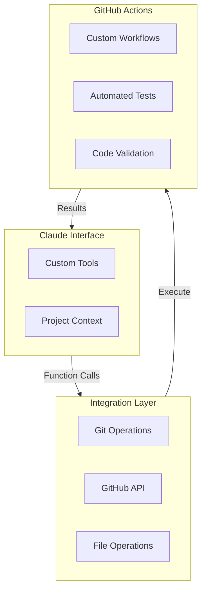

# Basic Factory

AI-assisted software development workflow tools.

## Overview

Basic Factory provides tools for integrating AI assistants (like Claude) into software development workflows via GitHub. It enables AI assistants to:

- Create and manage branches
- Commit changes
- Create pull requests
- Run and monitor GitHub Actions
- Participate in code review

## Github
For the GitHub token, you'll need to:

Go to GitHub Settings → Developer Settings → Personal Access Tokens
https://docs.github.com/en/authentication/keeping-your-account-and-data-secure/managing-your-personal-access-tokens


Create a new token with 'repo' scope
We can use this for both direct API calls and for GitHub Actions

## Installation

```bash
uv add basic-factory
```

## Development

Set up development environment:

```bash
# Create virtual environment
uv venv
uv sync 

# Install project in editable mode with dev dependencies
uv add --dev --editable .
uv add --dev pytest pytest-cov ruff

source .venv/bin/activate

# Run tests
pytest
```




## Flow:

Paul is a software developer
Claude is an AI

Old:

Paul and Claude are collaborating on a software project in a git repo on GitHub
They chat in the Claud AI chat dialog and Claude creates code artifacts
Paul copiy/pastes the code into his dev environment and runs and tests it
They continue refining and collaborating until done
Paul pushes the changes to the Github repo, perhaps on a feature branch
Tess run in remote repo
repeat process

New:
Paul and Claude are collaborating on a software project in a git repo on GitHub
They chat in the Claud AI chat dialog and Claude creates code artifacts
Claude uses his tools interface to send the changes to the repo
    - Claude creates the code artifacts
    - Claude creates a branch
    - Claude commits changes to the branch
    - The feature branch is pushed to the repo on GitHub
    - Tests are run and a Pull Request is created
Paul can review the pull request
Claude can see the output of the tests and actions run in the repo 
They can continue to dialog about the changes in the feature branch and make more changes
When they are done, Paul will merge the branch

Tools required:
tools that Claude can directly use through his tool use capabilities:

create_branch: Create new branches
commit_files: Commit files from Claude artifacts
push_branch: push branch to remote Github repo 
create_pull_request: Create PRs with Claude's descriptions
get_workflow_status: Monitor GitHub Actions status