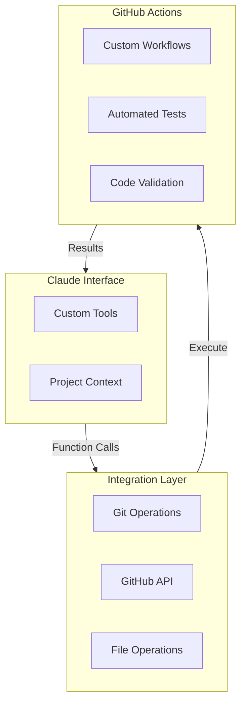

# Basic Factory

AI-assisted software development workflow tools.

## Overview

Basic Factory provides tools for integrating AI assistants (like Claude) into software development workflows via GitHub. It enables AI assistants to:

- Create and manage branches
- Commit changes
- Create pull requests
- Run and monitor GitHub Actions
- Participate in code review

## Github
For the GitHub token, you'll need to:

Go to GitHub Settings → Developer Settings → Personal Access Tokens
https://docs.github.com/en/authentication/keeping-your-account-and-data-secure/managing-your-personal-access-tokens


Create a new token with 'repo' scope
We can use this for both direct API calls and for GitHub Actions

## Installation

```bash
uv add basic-factory
```

## Development

Set up development environment:

```bash
# Create virtual environment
uv venv
uv sync 

# Install project in editable mode with dev dependencies
uv add --dev --editable .
uv add --dev pytest pytest-cov ruff

source .venv/bin/activate

# Run tests
pytest
```


