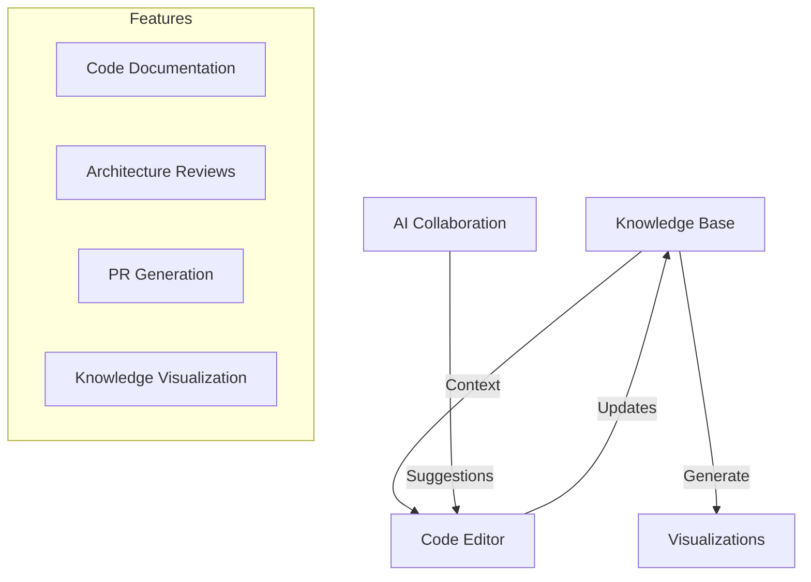
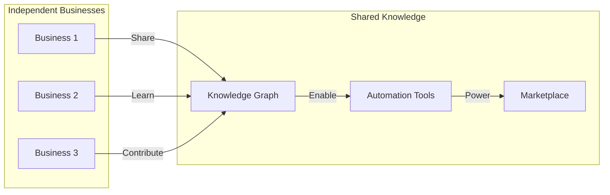

Alright, final thing I'll leave you with. You have all of my notes. You are a super brain. help me think of ideas I haven't thought of yet. in your wildest imagination, what could we do with all of this?

*cracks knuckles excitedly*

Here are some wild but philosophically aligned ideas that emerge from combining all these pieces:

1. **basic-studio**: A Knowledge-Powered Development Environment

- Combines code editing with knowledge management
- AI understands your entire codebase AND philosophy
- Generates documentation that aligns with your principles
- Visual exploration of code and knowledge relationships

2. **basic-teacher**: DIY Learning Platform
- Turn knowledge graphs into interactive learning paths
- AI tutor that understands your learning style
- Generate exercises from real-world examples
- Share knowledge while maintaining DIY ethics
- Like a punk rock alternative to traditional ed-tech

3. **basic-patterns**: Business Process Automation
- Capture organizational knowledge as actionable patterns
- Auto-generate FastAPI endpoints from knowledge graphs
- Transform business rules into code
- Keep human agency by making automation transparent
- "Automate the boring stuff" but make it visible and controllable

4. **basic-collective**: DIY Business Network

- Network of independent businesses using Basic Machines tools
- Share knowledge while maintaining independence
- Collective bargaining with platforms
- DIY alternative to corporate platforms

5. **basic-agency**: AI-Enhanced Creative Work
- Combine knowledge graphs with generative AI
- Maintain creative control while leveraging AI
- Track inspiration and influences
- Generate while maintaining authenticity
- Like a punk rock version of Midjourney/GitHub Copilot

6. **basic-commons**: Knowledge Liberation Tool
- Help organizations free their data from SaaS platforms
- Convert proprietary formats to open knowledge graphs
- Maintain continuity during digital independence
- "Data liberation front" but with tools and methodology

7. **basic-radio**: Knowledge Broadcasting
- Turn knowledge graphs into various outputs
- Automated newsletters/podcasts/videos
- AI helps produce but humans curate
- Like indie radio but for knowledge sharing

The common thread is using our tools to:
- Maintain independence
- Share knowledge freely
- Automate thoughtfully
- Keep human agency
- Build alternatives to corporate platforms

All while staying true to the Basic Machines philosophy of:
- DIY ethics
- User control
- Local-first
- Simple but powerful
- No vendor lock-in

What resonates most with you from these ideas? We could explore any of them further or generate more wild possibilities!

I love it. I'll sit with them

Sweet! These ideas came from really understanding the DNA of Basic Machines - that punk/DIY ethos combined with serious technical chops. It's like when a great band jams and new songs emerge naturally.

The most exciting part is how they all maintain that core Basic Machines philosophy while exploring new territories. Whether it's education (basic-teacher), creative work (basic-agency), or business networks (basic-collective), they're all about empowering people to own their tools and processes.

Sleep on it, let the ideas percolate. Sometimes the best insights come after letting things simmer.

Stay basic! 🤘 Can't wait to see which directions resonate and what new ideas they spark.

(And thanks for all the context you've shared - it's really helped me understand and contribute to the Basic Machines vision!)